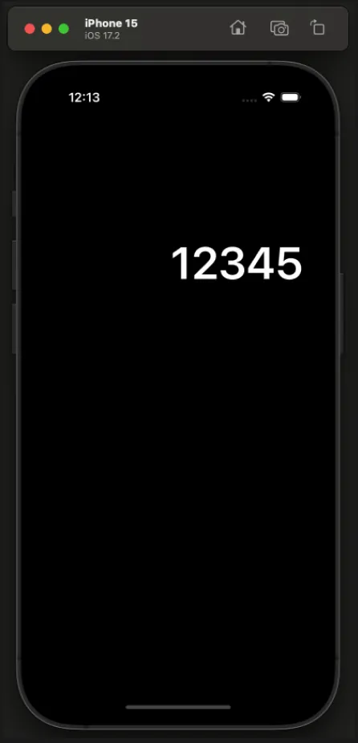
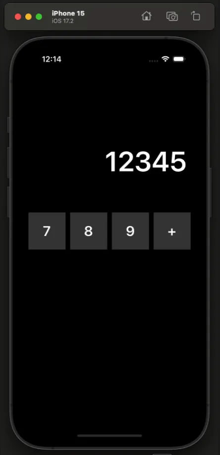
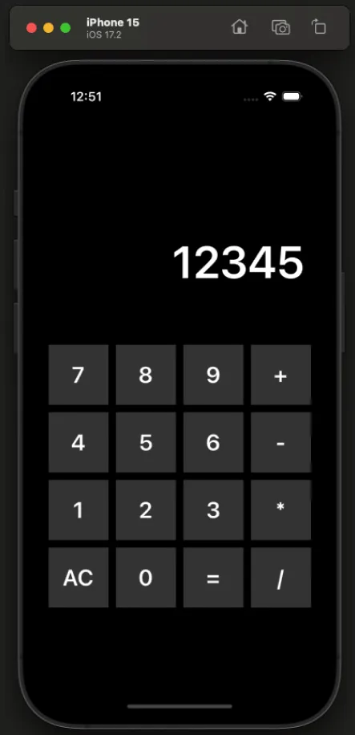
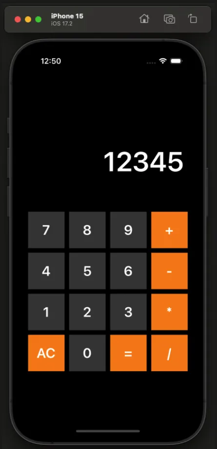
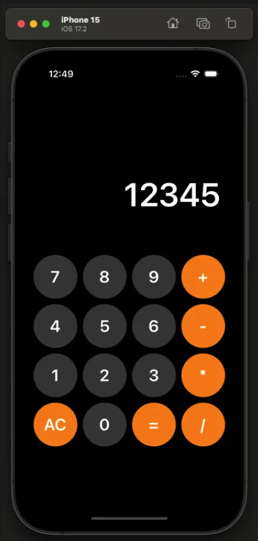
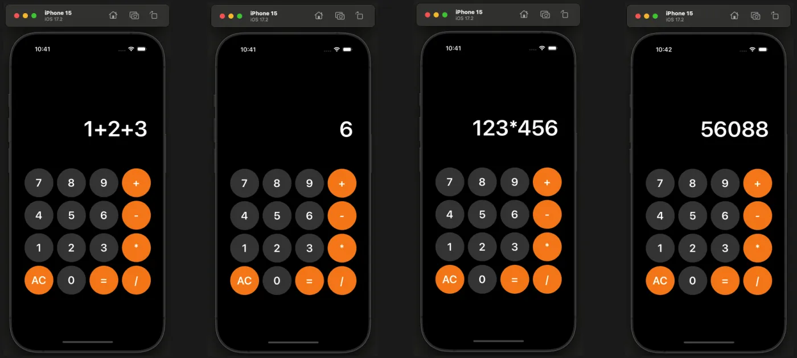

# 계산기 만들기 과제 (Week 3-4)
***

## 📚 레벨별 구현 내용
### **필수 구현**

| Lv 1 | Lv 2 | Lv 3 | Lv 4 | Lv 5 |
| :-: | :-: | :-: | :-: | :-: |
|  |  |  |  |  |
| UILabel 생성하기 | UIStackView 사용하기 | UIStackVIew 추가 생성하기 | 버튼 색상 변경 | 버튼 모양 원형으로 만들기 |

### **도전 구현**

- Lv 6
    1. 버튼을 클릭하면 라벨에 표시되도록 변경
    2. 기본 텍스트를 "12345" -> "0" 으로 변경
    3. 기본으로 라벨에 노출되어있던 텍스트 오른쪽에 버튼을 클릭하면 그 버튼의 값이 추가되도록 합니다.
        - EX)
            - 맨처음 기본값 `0` 
            - 그 다음 `1` 클릭했음 → 표시되는 값은 `01` 
            - 그 다음 `2` 클릭했음 → 표시되는 값은 `02` 
            - 그 다음 `+` 클릭했음 → 표시되는 값은 `02+` 
            - 그 다음 `3` 클릭했음 → 표시되는 값은 `02+3` 
        - 하지만 `012` 라는 값은 이상하기 때문에 맨 앞자리가 `0` 인 숫자라면, 0을 지우고 표현
        - EX) `012` → `12` 로 표현
    
- Lv 7
    1. 초기화 버튼 구현
    2. `AC` 버튼을 클릭하면 모든 값을 지우고 "0"으로 초기화
        
- Lv 8
    1. 등호(`=`) 버튼을 클릭하면 연산이 수행되도록 구현
    2. EX)
        - `1+2+3`을 입력 후 `=`을 클릭하면 결과값 `6` 출력
        - `123*456`을 입력 후 `=`을 클릭하면 결과값 `56088` 출력
    

***

## ⏰ 과제 일정
- 시작: 11월 11일 (월)
- 종료: 11월 22일 (금) PM 12:00 까지

***

## 🔥 구현 목표 🔥
- 코드를 최대한 재사용성을 살려 사용하기
- 도전구현까지 모두 완료해보기
- 예외상황에 대한 처리(Error) 진행하기
- 문서 주석을 활용한 앱 설명 구체화하기

***

## ✖️➗ 계산기 기능 ➕➖
### 1. 계산 기능
- 정수와 연산자 기호를 이용하여 계산을 할 수 있다.
- 더하기, 빼기, 곱하기, 나누기의 계산을 할 수 있다.

### 2. 오류 출력 기능
- 잘못된 입력(ex: 1++)을 감지하고 에러를 반환하는 기능

### 3. 초기화 기능
- 입력한 값을 모두 초기화 하는 기능

***

## 🤔 레벨별 고민했던 점
### Lv 1.
레벨 1에서 고민했던 점은 과제의 진행을 코드베이스로 할지, 스토리보드로 할지 정하는 것이었다.
시간이 남는다면 둘 다 진행해보겠지만, 지금 내 실력에서는 어려울 것 같다고 생각했고,
내게 조금 더 잘 맞는 방식이었던 코드베이스 방식을 선택했다.

### Lv 2.
레벨 2에서 고민했던 점은 코드의 재활용성에 대한 문제이다.
스택뷰를 사용하여 버튼을 구성하였는데, 단순히 스택뷰를 인스턴스화 하여 선언하고 내부에 버튼을 구현하면
코드가 너무 길어져서 가독성이 크게 떨어졌다.
때문에 기본적인 값을 가진 스택뷰를 클래스로 정의했고, 클래스 메소드를 통해 스택뷰 내부에 뷰 요소를 쉽게 추가할 수 있도록 하였다. 그러나 여전히 버튼에 대한 오토레이아웃이나 설정 때문에 코드의 가독성이 떨어진다고 생각되었다.
때문에 버튼의 데이터를 담는 배열을 생성하고, 버튼의 값 및 오토레이아웃을 한번에 설정할 수 있는 메소드를 구현하여 사용하였고, 덕분에 코드의 가독성을 높일 수 있었다.

여기서 고민했던 점은 메소드의 매개변수가 너무 많아지는 것은 오히려 코드의 가독성을 헤치지 않을까? 하는 점이었다.
필요한 변수를 매개변수로 지정하다보니 필요한 매개변수의 양이 많아졌고, 때문에 메소드의 선언 길이가 길어졌다. 매개변수의 길이를 줄일 수 있는 방법이 무엇이 있을까 고민해보았지만 클로저 외에는 답이 떠오르지 않았다. 그러나 클로저도 올바른 답인지는 알 수 없었다.

### Lv 3.
레벨 3에서는 `horizontal` 스택뷰와 `vertical` 스택뷰를 이용하여 버튼구성을 구현해야 한다. 처음에는 왜 굳이 `vertical` 스택뷰를 같이 사용할까? 의문이 들었다. 왜냐하면 `horizontal` 스택뷰를 어차피 4개 만들어야 하니 각각의 스택뷰에 오토레이아웃 값을 맞춰주면 되는거 아닌가? 생각했기 때문이다.
그러나 이렇게 하면 코드가 너무 길어지고 지저분해져서 가독성이 떨어진다. 때문에 `vertical` 스택뷰 내에 `horizontal` 스택뷰를 넣고 한번에 관리할 수 있도록 하는 것이다.

레벨 2에서는 버튼의 `.setTitle` 등의 메소드를 통해 버튼을 구현했었는데, 팀원에게 `Configuration`이라는게 있다는 걸 듣게 되었다. 그래서 공부를 해보니 iOS 15 이상부터 사용이 가능해진 방식으로, `UIButton.configuration` 값을 생성하여 여기에 버튼에 대한 값을 지정하고, 버튼에 해당 `Configuration`을 할당하면 버튼의 구현이 완료되는 방식이었다.
`Configuration`으로 버튼을 구현하는 방식이 조금 더 커스텀이 자유로운 느낌이었기 때문에 이번 과제 레벨 3에서 구현에 도전해보았고, `configurationUpdateHandler`를 통해 버튼이 눌렸을 때의 변화까지 구현해보았다.
걱정되는 점은 `Configuration`의 구현방식을 지원하는 것이 **iOS 15 이상** 이라는 점이다. 최신버전이 18.1 버전인만큼 대부분의 사람은 15 이상의 버전을 사용하겠지만, 그렇지 않은 경우 버튼의 구현이 되지 않을 가능성이 있다는 점이 걱정이었다. 추후에는 iOS 버전에 따라 구현방식을 달리하는 방식으로 해결할 수 있으리라고 생각한다.

### Lv 4.
레벨 4에서는 숫자 버튼을 제외한 나머지 버튼의 색을 오렌지색으로 변경하는 것을 구현하였다. 버튼을 2차원 배열로하여 메소드를 통해 구현했기 때문에 어떻게 하면 좋을까 고민을 많이 했던 것 같다. 만약 모든 버튼에 대해 별도로 구현했다면 적용이 쉬웠을텐데, 라고 생각하다가 문득 숫자라는 점이 눈에 띄었다.
숫자 외에 색을 바꾸는 것이라면, 현재 버튼의 타이틀을 `Int`로 형변환이 가능한지 확인하면 되지 않을까? 라는 생각으로 새로운 메소드를 만들었다. 파라미터로 `UIButton`을 받고, 반환값으로 `UIColor`를 반환하게 하여 내부적으로 `if`문을 통해 파라미터로 들어온 버튼의 타이틀을 `Int`로 형변환이 가능한지 확인하고, 가능할 경우 그레이색으로, 불가능할 경우 오렌지색을 반환하도록 구현하였다.
이후, 버튼의 `Configuration`의 설정에서 `baseBackgroundColor`를 새로 만든 메소드로 지정하여 메소드 내에서 알아서 판단하여 색을 적용하도록 하였다.
결과적으로 의도한 대로 숫자 외에는 모두 오렌지색이 적용되어 무사히 레벨4를 마칠 수 있었다.

### Lv 5.
레벨 5에서는 버튼의 모양을 원형으로 바꾸는 작업을 진행하였다. 버튼은 `width: 80, height: 80`의 정사각형 이었기 때문에 버튼의 `cornerRadius`를 40으로 설정했다면 원형으로 만들 수 있었을 것이다.
그러나 나는 버튼의 구현을 `configuration`을 사용하여 구현했기 때문에, 이번에도 `configuration`의 기능을 사용해보기로 했다. `configuration`의 프로퍼티 중 `cornerStyle`이라는 옵션이 있다. 이 속성을 사용하면 버튼의 코너 스타일을 자유롭게 지정할 수 있는데, 이 중 `capsule` 옵션을 선택하면 자동으로 `Radius`값을 최대로 적용해주기 때문에 버튼을 원형으로 만들어줄 수 있었다.

### Lv 6.
레벨 6을 진행하며 가장 큰 문제였던 것은 어떻게 버튼의 값을 레이블에 전달할 것인가, 였다.
왜냐하면 레이블은 `ViewController`에서 `private`로 접근이 제한되어 있고, 버튼은 `ButtonData`클래스에서 관리하고 있기 때문이다.
`ButtonData`클래스에서 어떻게 하면 `ViewController`에 있는 레이블에 값을 전달할 수 있을까 고민을 하고 서치를 해보았다. 그 중 가장 적절해 보였던 것이 델리게이트 패턴을 활용하는 것이었다.
우선, `ButtonDataDelegate`라는 파일을 새로 만들어 프로토콜을 생성하고, 메소드를 만든다. 그 후 `ButtonData` 클래스에 새로운 프로퍼티를 생성하여 타입을 `ButtonDataDelegate` 타입으로 하고, 옵셔널로 지정한다. 이렇게 하면 이니셜라이저를 구축할 필요가 없어서 좋다.
이제 버튼의 액션을 담당할 메소드를 만들고, 메소드 내부에 새로 만든 델리게이트 메소드를 실행하도록 만든다. 그럼 델리게이트의 값이 있을 경우 메소드의 작동이 이루어질 것이다. 마지막으로 `ViewController`에 `ButtonDataDelegate` 프로토콜을 채택하고, 일전에 만들었던 `ButtonData` 타입을 가지는 프로퍼티의 `delegate` 프로퍼티를 `self`로 지정한다. 이제 프로토콜 준수를 위해 메소드를 구현하면 되는데, 여기서 `ViewController`의 레이블 값에 접근하도록 만들어주면 버튼을 눌렀을 때 델리게이트 메소드가 작동하고, 이 델리게이트 메소드가 버튼의 값을 레이블에 전달해주게 된다.
이렇게 델리게이트 패턴을 활용하여 무사히 레벨 6의 과제를 구현할 수 있었다.

### Lv 7.
레벨 7에서는 AC 버튼, 초기화 버튼을 구현해야 했다.
델리게이트로 넘어오는 파라미터의 타입은 `String`으로, 버튼의 타이틀 값을 가져온다. 때문에 `didTapButton` 메소드 내부에 `if`문을 구현하여 만약 파라미터 값이 `"AC"`일 경우 레이블 값을 0으로 초기화하게 만들었고, 그렇지 않을 경우 값을 변경하거나 추가하도록 만들었다.

### Lv 8.
레벨 8에서는 사칙연산 기능이 작동하도록 만들어야 했다. 처음에는 과제에서 제공해주는 메소드를 사용하지 않고 직접 구현해보려고 했으나 너무도 복잡하고 코드가 복잡해지는 탓에 주어진 메소드를 활용하기로 하였다.
계산기능의 구현은 AC 기능을 구현할 때와 마찬가지로 델리게이트 메소드의 파라미터로 들어오는 `String`값이 `"="` 이라면 계산 메소드가 실행되도록 했다. 다만, 안전을 위해 현재 레이블의 값을 확인하는 `guard`문을 추가하고, 추가로 계산 결과를 저장하는 변수를 만들어 이 변수의 값이 `nil`인지 체크하여 레이블에 어떻게 값을 반영할 것인지 삼항연산자를 통해 구현하였다.

### Another Feature
1. **에러타입 추가**

기존 레벨 8까지 구현한 계산기는 잘못된 연산(ex. 1++)을 하면 앱이 크래시가 발생하여 강제종료 되었다. 이것은 사용자에게 좋은 경험을 주지 못할 것이라고 생각하여 `CalculatorError`라는 파일을 만들고 계산기 앱을 사용하여 발생할 수 있는 에러들을 정의하였다.
이후 `Calculator`의 메소드를 수정하여 에러를 던질 수 있도록 하고, 어떤 에러가 발생했는지 확인할 수 있도록 에러에 대한 내용을 콘솔 창에 출력하도록 하였다.
    
_구현 모습_

***
    
2. **FatalError**

`do-try-catch`문을 통해 에러를 제어할 때, 개발자가 정의한 에러가 아닌 다른 에러가 발생할 때를 대비하여 마지막에 항상 `catch`를 통해 정의된 에러 외의 에러를 모두 잡을 수 있도록 한다. 그런데 만약 개발자가 생각하지 못했던, 예기치 못한 오류가 발생하고 이것이 치명적인 에러(fatal error)라면 어떻게 할까?
이에 대해 고민을 하며 서치를 하던 중 꽤 예전에 애플이 문서로 제시한 `Graceful Terminate` 즉, 우아한 종료에 대해 설명하는 글을 보았다. 애플은 iOS에서 앱을 종료하는 방법은 홈 버튼이나 제스처를 통한 종료 밖에 없다고 하였고, 앱이 갑작스럽게 종료되는 것은 사용자에게 불편한 경험을 줄 것이라며 앱의 종료 방법에 대한 내용을 정리해두었다.
정리하자면, 앱이 제 기능을 하지 못하여 강제종료가 되어야 하는 상황이라면 `Alert`등을 통해 사용자에게 알리도록 하고, 갑작스럽게 앱이 종료되는 것처럼 느끼지 않게 홈 스크린으로 돌아가는 애니메이션과 함께 우아하게 앱을 종료하라고 하였다.
    
이러한 글을 읽고 새삼스럽게 애플의 디테일에 감탄하며, 어떻게 하면 우아하게 앱을 종료할 수 있을까 찾아보았고, 코드를 통해 앱을 백그라운드로 보낸 후 앱을 종료하는 기능을 구현한 글을 찾을 수 있었다. 이 글을 보고 나도 우아한 종료에 대한 구현에 도전해보았고, 사용자를 위한 기능이란 무엇인지에 대해 생각해볼 수 있었다.
    
_구현 모습_

***
    
3. **Label Text Limit**

계산기의 레이블은 크기가 고정되어 있는 탓에 입력값이 일정량을 넘어가면 `123456...`과 같은 형태로 표현된다. 만약 레이블의 길이가 긴 값을 계산해야 하는데 사용자가 입력한 값이 전부 표시되지 않는다면 오류가 있는지 없는지 체크하기 어려울 것이다.
때문에 이러한 현상을 해결하기 위하여 스크롤뷰를 사용하여 레이블의 길이가 길어지면 스크롤이 자동으로 이루어지도록 구현하였다. 이렇게 하면 사용자는 스크롤 제스처를 통해 값이 제대로 입력되었는지 확인할 수 있기 때문에 실수를 줄일 수 있을 것이라고 판단했다.
    
어려웠던 점은 레이블이 항상 오른쪽 정렬이 되어있어야 하는데, 스크롤뷰에 레이블을 넣으니 자동으로 왼쪽 정렬이 되는 점이었다. 이를 어떻게 해결할 수 있을까 고민을 하다가 `contentAlignmentPoint`라는 옵션을 발견했다. 조사해보니 이 속성은 스크롤뷰의 컨텐츠의 사이즈가 너무 큰 경우 특정한 위치에서부터 컨텐츠를 보여줄 수 있도록 좌표값을 설정하는 옵션이라고 한다. 그러나 컨텐츠 사이즈가 스크롤보다 작을 경우에는 컨텐츠의 위치를 어디에 둘지 정할 수 있었는데, 예를 들어 x 좌표를 0.5로 설정한다면 스크롤 뷰의 중앙에 위치하게 되는 식이었다. 나는 이 속성을 사용하여 `scrollView.contentAlignmentPoint.x = 1`로 레이블을 오른쪽 정렬을 시키는 것에 성공할 수 있었다.
    
두번째 문제점은 레이블의 길이가 길어져 스크롤뷰보다 커졌을 때 항상 레이블의 마지막값(최우측)을 보여주도록 구현하고 싶었는데, 어떻게 해도 스크롤뷰의 위치를 바꿔줄 수 없었다. `viewWillLayoutSubviews`를 사용하여 생명주기에서 업데이트를 하려고 해도 생각한 대로 잘 이루어지지 않았다.
그러던 중 한 가지 아이디어가 떠올랐다. 레이블의 값은 버튼을 눌렀을 때 변화가 일어난다. 그렇다면 버튼을 눌렀을 때 특정 이벤트가 발생하여 스크롤뷰의 위치를 바꾸면 되지 않을까?
나는 곧바로 메소드 구현에 돌입했고, 컨텐츠의 사이즈가 스크롤뷰보다 커진다면 컨텐츠뷰의 `offset`을 오른쪽 끝으로 보내도록 구현하였다. 그리고 버튼 액션 메소드에 해당 메소드를 추가하여 빌드를 해보니 의도대로 잘 작동했다!!
다만, `"AC"`버튼을 눌렀을 때, 컨텐츠뷰의 사이즈가 유동적으로 변하는 탓인지 레이블 값이 왼쪽으로 치우치는 버그가 있었기 때문에 컨텐츠뷰의 위치를 리셋해주는 메소드를 추가로 구현해 주어야 했다. 그리고 `"AC"`를 눌렀을 때 리셋이 되는 메소드가 실행되도록 했더니 문제가 해결되었다.
    
_구현 모습_

***
